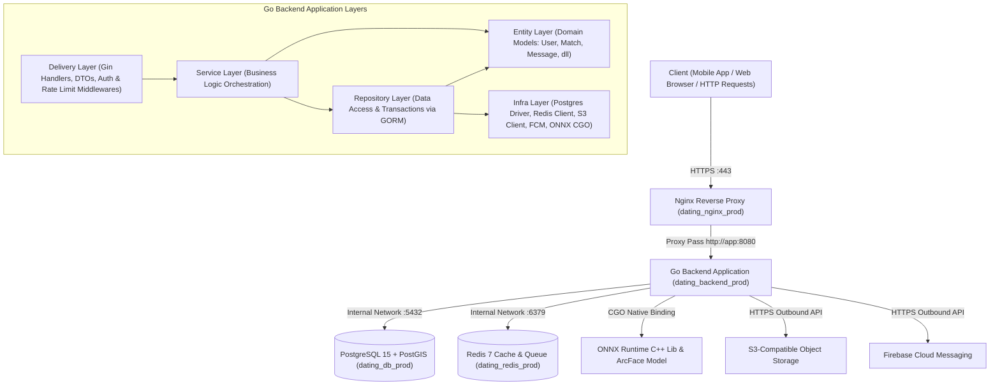
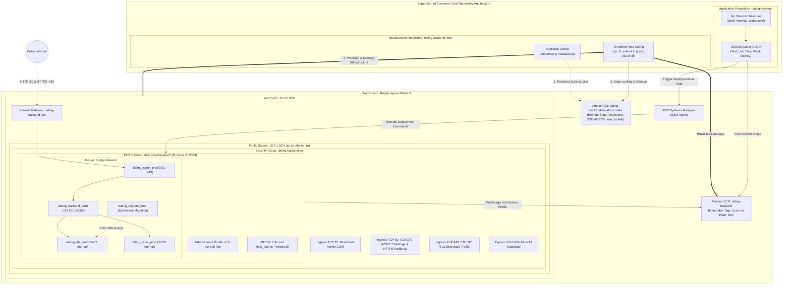
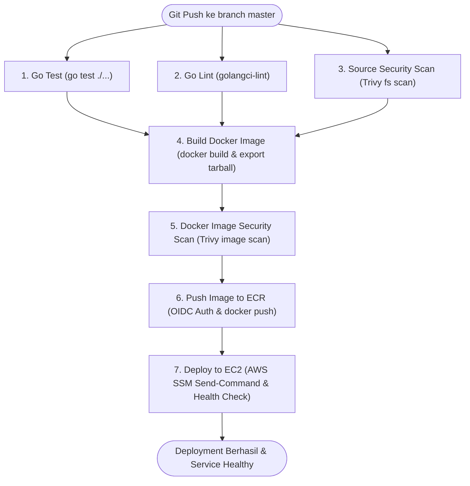
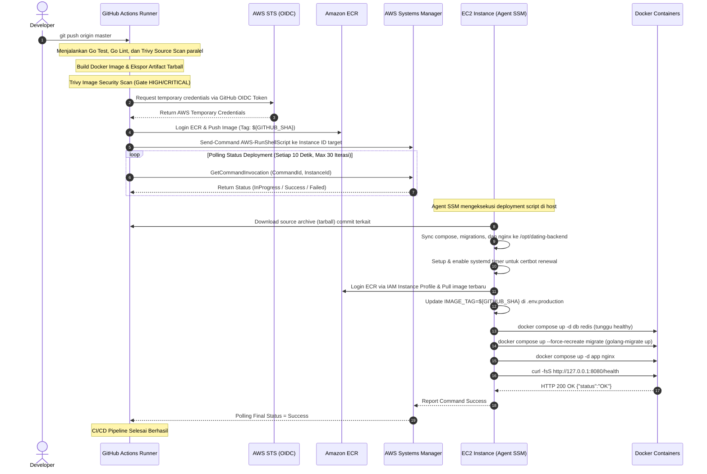
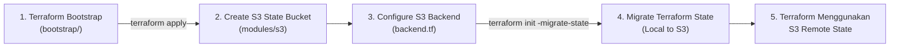

# Dating App Backend & Infrastructure

[](https://github.com/AlfianMI/dating-backend/actions)
[](https://go.dev/)
[](https://gin-gonic.com/)
[](https://www.postgresql.org/)
[](https://redis.io/)
[](https://www.terraform.io/)
[](https://aws.amazon.com/)
[](https://trivy.dev/)

Dokumentasi teknis ini menjelaskan arsitektur backend, otomasi deployment, dan provisioning infrastruktur untuk project aplikasi dating app. Sistem dibangun menggunakan **Go** dengan pola **Clean Architecture**, di-deploy ke **AWS EC2** menggunakan **Docker Compose**, dan seluruh AWS resource dikelola secara deklaratif menggunakan **Terraform** pada region `ap-southeast-1` (Singapura).

Project ini menerapkan prinsip **Separation of Concerns (SoC)** dengan memisahkan kode aplikasi dan infrastruktur ke dalam dua repository terpisah yang saling terintegrasi:
1. **Application Repository (`dating-backend`)**: Berfokus pada siklus hidup aplikasi — mencakup source code Go backend (Clean Architecture), multi-stage Dockerfile, konfigurasi Docker Compose production, reverse proxy Nginx, skrip otomatisasi perpanjangan sertifikat SSL Let's Encrypt, skema migration database SQL, dan workflow CI/CD GitHub Actions.
2. **Infrastructure Repository (`dating-backend-infra`)**: Berfokus pada provisioning dan pengelolaan seluruh cloud infrastructure AWS secara deklaratif via Terraform — mencakup VPC, Public Subnet, Internet Gateway, Route Table, Security Group, IAM Role & OIDC Identity Provider, EC2 Instance, Amazon ECR, serta dedicated S3 Bucket untuk Terraform Remote State storage. Pemisahan ini menjamin siklus rilis aplikasi independen dari perubahan arsitektur cloud.

---

## Daftar Isi
1. [Project Overview](#1-project-overview)
2. [Tujuan Project](#2-tujuan-project)
3. [Technology Stack](#3-technology-stack)
4. [Repository Structure](#4-repository-structure)
5. [Application Architecture](#5-application-architecture)
6. [AWS Infrastructure Architecture](#6-aws-infrastructure-architecture)
7. [CI/CD Pipeline](#7-cicd-pipeline)
8. [Deployment Flow](#8-deployment-flow)
9. [Docker Architecture](#9-docker-architecture)
10. [Production Services](#10-production-services)
11. [Nginx dan HTTPS](#11-nginx-dan-https)
12. [Database dan Migration](#12-database-dan-migration)
13. [Security](#13-security)
14. [Secret Management](#14-secret-management)
15. [Local Development](#15-local-development)
16. [Docker Development](#16-docker-development)
17. [Production Deployment](#17-production-deployment)
18. [Health Check](#18-health-check)
19. [Infrastructure Repository](#19-infrastructure-repository)
20. [Project Status](#20-project-status)

---

## 1. Project Overview

**Dating App Backend** adalah platform RESTful API dan komunikasi real-time WebSocket yang dirancang untuk mendukung layanan aplikasi kencan. Backend menangani flow otentikasi user (Google OAuth dan Email/Password), interaksi swipe matching, real-time messaging, verifikasi wajah biometrik berbasis machine learning (ArcFace ResNet50 via C++ ONNX Runtime), sistem monetisasi/langganan, push notification seluler melalui Firebase Cloud Messaging (FCM), serta kalkulasi geolokasi user menggunakan ekstensi PostGIS.

Dari sudut pandang DevOps dan Cloud Infrastructure:
- **Infrastructure as Code (IaC)**: Provisioning infrastructure AWS dikelola penuh via Terraform secara modular di region `ap-southeast-1`.
- **Zero-Key OIDC Deployment**: CI/CD pipeline GitHub Actions terhubung ke AWS menggunakan federasi OpenID Connect (OIDC) via AWS STS. Tidak ada kredensial AWS statis (`AWS_ACCESS_KEY_ID` / `AWS_SECRET_ACCESS_KEY`) yang disimpan di runner.
- **Automated Security Gates**: Setiap push ke branch `master` melalui pemindaian keamanan bertingkat oleh Aqua Security Trivy, mencakup filesystem (vulnerability, misconfiguration, secret leak) dan Docker container image.
- **Network Isolation**: Database PostgreSQL/PostGIS dan cache Redis tidak mengekspos port ke host ataupun internet publik. Backend Go hanya binding ke host loopback `127.0.0.1:8080`, dan satu-satunya entry point publik adalah reverse proxy Nginx (port 80 dan 443).
- **Keyless Deployment via AWS SSM**: Deployment ke instance EC2 dieksekusi melalui AWS Systems Manager (SSM) Run Command. Tidak ada port SSH (port 22) yang dibuka ke publik internet untuk deployment runner.
- **Automated TLS Lifecycle**: Nginx melayani domain `api.swipee.pipigendut.space` dengan sertifikat Let's Encrypt yang diperbarui secara otomatis menggunakan systemd timer dan service dua kali sehari.

---

## 2. Tujuan Project

### Problem Statement
1. **Human Error pada Deployment Manual**: Proses build lokal, transfer file via SCP, dan restart service secara interaktif rentan menyebabkan downtime dan inkonsistensi konfigurasi antar environment.
2. **Risiko Long-Lived Static Credentials**: Menyimpan access key statis AWS di third-party CI runner memiliki risiko eksfiltrasi dan compromise jika runner terkompromi.
3. **Pemaparan Port Internal ke Internet**: Membuka port database (`5432`), Redis (`6379`), atau application port (`8080`) secara langsung ke publik meningkatkan attack surface secara signifikan.
4. **Kegagalan Pembaruan SSL Manual**: Ketergantungan pada pembaruan manual untuk sertifikat SSL sering kali berujung pada expired certificate yang memutus koneksi client seluler.

### Solusi yang Diimplementasikan
1. **Fully Automated CI/CD Pipeline**: Seluruh proses dari testing, linting, security scanning, container image build, push ke Amazon ECR, hingga deployment akhir ke EC2 berjalan otomatis tanpa campur tangan manual.
2. **Role-Based Web Identity (IAM OIDC)**: Menggunakan token OIDC sementara dari GitHub Actions yang ditukar ke AWS STS untuk mendapatkan temporary credentials dengan masa kedaluwarsa pendek.
3. **Defense-in-Depth Network Isolation**: Security Group hanya mengizinkan traffic port web (`80`, `443`) dan port SSH terbatas ke IP administrator. Container database dan Redis hanya bisa diakses dalam Docker bridge network internal.
4. **Automated SSL Lifecycle via Systemd**: Konfigurasi systemd timer dan service yang menjalankan container Certbot untuk me-renew sertifikat Let's Encrypt serta me-reload konfigurasi Nginx secara berkala tanpa downtime.

---

## 3. Technology Stack

### Backend Application
| Komponen | Teknologi | Versi | Peran & Deskripsi |
| :--- | :--- | :--- | :--- |
| **Language** | Go | `1.26.0` (`go.mod`) | Core language runtime dengan performa konkurensi tinggi |
| **Web Framework** | Gin Gonic | `v1.11.0` | Routing HTTP performa tinggi dan middleware pipeline |
| **Primary Database** | PostgreSQL + PostGIS | `15` / `3.3` | Relational database untuk transactional data dan geospatial query |
| **ORM** | GORM | `v1.31.1` (driver postgres `v1.6.0`) | Object-Relational Mapping dan database transaction management |
| **Cache & Task Queue** | Redis | `7-alpine` | In-memory cache store, rate limiter, dan broker queue |
| **Background Worker** | Asynq | `v0.26.0` | Background task orchestration dan worker scheduling |
| **Real-Time Messaging** | Gorilla WebSocket | `v1.5.3` | Full-duplex WebSocket connection untuk instant chat messaging |
| **Machine Learning** | ONNX Runtime Go | `v1.15.0` (lib `1.20.1`) | CGO binding ke ONNX Runtime untuk inferensi model ArcFace ResNet50 |
| **Database Migration** | golang-migrate | `v4.17.0` (CLI/Docker) / `v4.19.1` (`go.mod`) | Database schema versioning deklaratif |
| **Object Storage** | AWS SDK for Go v2 (S3) | `v1.41.1` (S3 `v1.96.0`) | Penyimpanan media upload kompatibel S3 (AWS S3 / OCI Storage) |
| **Push Notification** | Firebase Admin SDK | `v4.19.0` | Pengiriman push notification ke mobile app via FCM |
| **API Documentation** | Swaggo | `v1.16.6` | Generator OpenAPI spec dan Swagger UI |

### DevOps, Cloud & Infrastructure
| Komponen | Teknologi | Spesifikasi / Konfigurasi Aktual |
| :--- | :--- | :--- |
| **Cloud Provider** | Amazon Web Services (AWS) | Region `ap-southeast-1` (Singapura) |
| **Infrastructure as Code** | Terraform | Versi `>= 1.5.0`, AWS Provider `~> 6.0` (9 custom modules, refactored root) |
| **Remote State Storage** | Amazon S3 | Dedicated S3 Bucket, Versioning, SSE-AES256, State Locking (`use_lockfile = true`) |
| **Compute Engine** | Amazon EC2 | Instance type `t3.micro`, Pinned AMI AL2023 (`ami-0c6b3b583f6e55a2f`), IMDSv2 Enforced |
| **Container Registry** | Amazon ECR | Private repository `dating-backend`, Tag Immutability & Scan on Push |
| **Remote Management** | AWS Systems Manager (SSM) | Eksekusi remote script via document `AWS-RunShellScript` |
| **CI/CD Platform** | GitHub Actions | 7 sequential jobs dengan AWS OIDC authentication |
| **Security Scanner** | Aqua Security Trivy | Filesystem & Docker image vulnerability scanning (`HIGH`, `CRITICAL`) |
| **Web Server / Reverse Proxy** | Nginx | `1.29-alpine`, SSL termination, proxy pass ke `app:8080` |
| **Certificate Authority** | Let's Encrypt Certbot | `certbot/certbot:latest`, HTTP-01 webroot challenge via systemd timer |

---

## 4. Repository Structure

### 1. Application Repository (`dating-backend`)
```text
dating-backend/
├── .github/
│   └── workflows/
│       └── docker-build-push.yml        # CI/CD workflow GitHub Actions (7 jobs)
├── cmd/
│   ├── app/
│   │   └── main.go                      # Entry point utama aplikasi Go
│   ├── migrate/
│   │   └── main.go                      # CLI database migration tool
│   └── seed/
│       └── main.go                      # CLI master data seeder
├── internal/
│   ├── background/                      # Registrasi task handler dan worker Asynq
│   ├── bootstrap/                       # Inisialisasi koneksi database, cache, dan config
│   ├── delivery/http/                   # HTTP handlers, DTO structs, dan API middlewares
│   ├── entities/                        # Domain models dan core entity schema
│   ├── infra/                           # Adapter PostgreSQL, Redis, S3, FCM, dan ONNX ML
│   ├── providers/                       # Third-party service providers (GIF, storage, dll)
│   ├── repository/                      # Data persistence layer menggunakan GORM
│   ├── services/                        # Business logic orchestration
│   └── websocket/                       # WebSocket hub dan client connection lifecycle
├── migrations/                          # SQL migration files berpasangan (up & down)
│   ├── 000001_initial_schema.up.sql / .down.sql
│   ├── 000002_create_advertisements_table.up.sql / .down.sql
│   └── 000003_add_gif_indexing.up.sql / .down.sql
├── nginx/
│   ├── nginx.bootstrap.conf             # Konfigurasi Nginx inisialisasi awal ACME challenge
│   └── nginx.conf                       # Konfigurasi Nginx production (Reverse Proxy & SSL)
├── ops/
│   └── certbot/
│       ├── dating-certbot-renew.service # Systemd service unit untuk certbot renew
│       ├── dating-certbot-renew.sh      # Shell script eksekusi certbot renew via container
│       └── dating-certbot-renew.timer   # Systemd timer unit jadwal 2x sehari
├── router/
│   ├── api/v1/                          # Routing endpoint API v1
│   └── router.go                        # Inisialisasi Gin router & endpoint /health
├── scripts/
│   └── setup_ml.sh                      # Shell script download ONNX Runtime C++ lib & model
├── .dockerignore
├── .env.development.example             # Template environment variables local development
├── .env.production.example              # Template environment variables production server
├── Dockerfile                           # Multi-stage Dockerfile untuk build dan runtime
├── Dockerfile.prod                      # Dockerfile alternatif runtime production
├── docker-compose.prod.yml              # Docker Compose stack untuk production environment
├── docker-compose.yml                   # Docker Compose stack untuk local development
├── go.mod                               # Go dependency definition (Go 1.26.0)
├── go.sum
└── Makefile                             # Helper command dev, prod, dan build
```

### 2. Infrastructure Repository (`dating-backend-infra`)
```text
dating-backend-infra/
├── backend.tf                           # Konfigurasi S3 Remote State & State Locking (use_lockfile = true)
├── ec2.tf                               # Pemanggilan modul EC2 (Pinned AMI & IMDSv2)
├── ecr.tf                               # Pemanggilan modul ECR Private Repository
├── iam.tf                               # Pemanggilan modul IAM Role & GitHub Actions OIDC
├── internet_gateway.tf                  # Pemanggilan modul Internet Gateway
├── outputs.tf                           # Definisi output variables (IP publik, VPC ID, URL ECR)
├── providers.tf                         # Konfigurasi AWS Provider (~> 6.0) dan versi Terraform
├── route_table.tf                       # Pemanggilan modul Route Table & Subnet Association
├── security_group.tf                    # Pemanggilan modul Security Group
├── subnet.tf                            # Pemanggilan modul Public Subnet
├── variables.tf                         # Definisi input variables (termasuk sensitive ami_id)
├── vpc.tf                               # Pemanggilan modul VPC
│
├── bootstrap/                           # Konfigurasi Terraform bootstrap terpisah untuk S3 state bucket
│   ├── .terraform.lock.hcl
│   ├── main.tf
│   └── providers.tf
│
└── modules/
    ├── ec2/                             # Modul EC2 instance, Pinned AMI AL2023, IMDSv2, user data
    ├── ecr/                             # Modul ECR repository, immutability, lifecycle policy
    ├── iam/                             # Modul IAM roles (EC2 instance profile & GitHub OIDC)
    ├── internet_gateway/                # Modul AWS Internet Gateway
    ├── route_table/                     # Modul Public Route Table & Subnet association
    ├── s3/                              # Modul S3 Remote State Bucket (Versioning, SSE-AES256, Lock)
    ├── security_group/                  # Modul Security Group rules (SSH, HTTP, HTTPS)
    ├── subnet/                          # Modul Public Subnet ap-southeast-1a
    └── vpc/                             # Modul AWS VPC (10.0.0.0/16) dengan DNS support
```

---

## 5. Application Architecture

Aplikasi dibangun mengadopsi prinsip **Clean Architecture**, memisahkan domain logic dari framework dan external drivers untuk mempermudah testing dan maintenance.



### Pembagian Layer Aplikasi
- **Delivery Layer (`internal/delivery/http/`)**: Mengelola request HTTP, binding dan validasi DTO, error response formatting, serta middleware (JWT validation dan rate limiter).
- **Service Layer (`internal/services/`)**: Mengimplementasikan core business logic aplikasi tanpa dependensi langsung ke framework HTTP.
- **Repository Layer (`internal/repository/`)**: Menangani abstraksi query database dan transactional operations menggunakan GORM.
- **Entity Layer (`internal/entities/`)**: Mendefinisikan struct domain model inti (User, Profile, Photo, Match, Swipe, Message, Group).
- **Infra Layer (`internal/infra/`)**: Menghubungkan aplikasi ke infrastruktur eksternal seperti database connection pooling, Redis caching, storage S3, push notification FCM, dan eksekusi model machine learning via ONNX Runtime CGO binding.

---

## 6. AWS Infrastructure Architecture

Infrastruktur cloud di-provision secara otomatis menggunakan 9 modul Terraform mandiri di region `ap-southeast-1` dengan pemisahan repository antara aplikasi dan infrastruktur:



### Rincian 9 Modul Terraform
1. **`modules/vpc`**: Membuat VPC dengan CIDR `10.0.0.0/16`, mengaktifkan `enable_dns_support = true` dan `enable_dns_hostnames = true`.
2. **`modules/subnet`**: Mengalokasikan public subnet dengan CIDR `10.0.1.0/24` di availability zone `ap-southeast-1a` dengan fitur `map_public_ip_on_launch = true`.
3. **`modules/internet_gateway`**: Membuat Internet Gateway dan menghubungkannya ke VPC untuk akses internet publik.
4. **`modules/route_table`**: Mengonfigurasi public route table dengan default route `0.0.0.0/0` via Internet Gateway, kemudian mengasosiasikannya ke public subnet.
5. **`modules/security_group`**:
   - Ingress TCP 22 (SSH): Dibatasi secara ketat ke CIDR administrator (`var.ssh_allowed_cidr`).
   - Ingress TCP 80 (HTTP): Terbuka ke `0.0.0.0/0` untuk HTTP-01 challenge Let's Encrypt dan pengalihan ke HTTPS.
   - Ingress TCP 443 (HTTPS): Terbuka ke `0.0.0.0/0` untuk melayani traffic HTTPS terenkripsi.
   - Egress: Terbuka penuh ke `0.0.0.0/0` untuk download package, image pull dari ECR, dan komunikasi outbound API.
   - **Port internal (8080, 5432, 6379) tidak dibuka sama sekali di tingkat Security Group AWS.**
6. **`modules/iam`**:
   - `aws_iam_role.ec2`: IAM Role untuk instance EC2 dengan managed policy `AmazonEC2ContainerRegistryReadOnly` (pull image ECR) dan `AmazonSSMManagedInstanceCore` (konektivitas agent SSM). Output `instance_profile_name` dikonsumsi langsung oleh module EC2.
   - `aws_iam_role.github_actions`: IAM Role untuk GitHub Actions runner menggunakan OIDC federated principal (`arn:aws:iam::992382472679:oidc-provider/token.actions.githubusercontent.com`) dengan condition `sub` terikat spesifik ke repository `repo:AlfianMI@94944686/dating-backend@1359818628:ref:refs/heads/master`. Diberikan policy `AmazonEC2ContainerRegistryPowerUser` dan inline policy `ssm:SendCommand` serta `ssm:GetCommandInvocation`.
7. **`modules/ec2`**: Menginisialisasi instance `t3.micro` dengan explicit AMI ID `ami-0c6b3b583f6e55a2f` (Amazon Linux 2023) melalui variable `ami_id`. Penentuan AMI ID secara eksplisit (pinned) menggantikan parameter SSM dinamis `/aws/service/ami-amazon-linux-latest/...` guna mencegah replacement EC2 secara tidak sengaja ketika AWS merilis versi AMI baru. Modul tetap mewajibkan **IMDSv2** (`http_tokens = "required"`), mengaitkan IAM instance profile, serta menjalankan user data script untuk bootstrap Docker daemon.
8. **`modules/ecr`**: Membuat private repository `dating-backend` dengan `image_tag_mutability = "IMMUTABLE"`, `scan_on_push = true`, serta lifecycle policy untuk mempertahankan maksimal 10 image terbaru.
9. **`modules/s3`**: Membuat dedicated S3 bucket untuk Terraform Remote State dengan versioning aktif, enkripsi AES256 (*at rest*), public access block penuh, Object Ownership `BucketOwnerEnforced`, serta `force_destroy = false` untuk proteksi state.

---

## 7. CI/CD Pipeline

Pipeline CI/CD didefinisikan pada file [.github/workflows/docker-build-push.yml](file:///home/miggu/project-final/dating-backend/.github/workflows/docker-build-push.yml) dan dipicu otomatis pada setiap event `push` ke branch `master`.

Pipeline terdiri dari **7 sequential jobs** dengan security gate ketat:



### Rincian 7 Jobs Pipeline
| No | Job Name | Action / Tools | Deskripsi & Validasi |
| :---: | :--- | :--- | :--- |
| **1** | **Go Test** | `actions/setup-go@v7` | Menjalankan automated unit test (`go test ./...`) dengan build caching module Go. |
| **2** | **Go Lint** | `golangci/golangci-lint-action@v9` | Menjalankan static code analysis untuk menjaga code quality dan standardisasi sintaks Go. |
| **3** | **Source Security Scan** | `aquasecurity/trivy-action@v0.36.0` | Memindai filesystem repository terhadap celah kerentanan dependensi (`vuln`), salah konfigurasi (`misconfig`), dan secret leak (`secret`) dengan severity `HIGH,CRITICAL` (`exit-code: 1`). |
| **4** | **Build Docker Image** | Docker Buildx & Artifact Upload | Membangun Docker image dengan tag `dating-backend:${{ github.sha }}`, menyimpan image dalam bentuk file tarball, dan mengunggahnya sebagai GitHub Actions artifact sementara. |
| **5** | **Docker Image Security Scan** | `aquasecurity/trivy-action@v0.36.0` | Mengunduh artifact tarball, me-load image ke Docker runner, dan memindai container image via Trivy. Pipeline otomatis gagal jika ditemukan celah `HIGH` atau `CRITICAL`. |
| **6** | **Push Image to ECR** | `aws-actions/configure-aws-credentials@v6` | Menukar GitHub OIDC token dengan temporary credentials AWS IAM Role, login ke Amazon ECR, memberi tag penuh, dan melakukan `docker push` ke repository privat ECR. |
| **7** | **Deploy to EC2** | AWS SSM `AWS-RunShellScript` | Autentikasi ke AWS via OIDC, mengeksekusi deployment script di EC2 via SSM Run Command, melakukan status polling per 10 detik, memicu migration database, dan memverifikasi status HTTP `/health`. |

---

## 8. Deployment Flow

Diagram alur berikut menggambarkan proses end-to-end deployment mulai dari developer melakukan commit hingga aplikasi berjalan sehat di server production:



---

## 9. Docker Architecture

Container backend Go dikemas menggunakan strategi **Multi-Stage Build** pada file [Dockerfile](file:///home/miggu/project-final/dating-backend/Dockerfile) untuk memastikan binary hasil kompilasi berukuran optimal, minim dependensi, dan aman saat runtime:

```dockerfile
# Stage 1: Build & Setup Machine Learning Libraries
FROM golang:1.26-bookworm AS builder
WORKDIR /app
ENV CGO_ENABLED=1

RUN apt-get update && apt-get install -y --no-install-recommends \
    ca-certificates curl bash gcc g++ && rm -rf /var/lib/apt/lists/*

COPY go.mod go.sum ./
RUN go mod download

COPY . .

ENV FORCE_OS=Linux FORCE_ARCH=x86_64
RUN bash ./scripts/setup_ml.sh
RUN go build -o main ./cmd/app/main.go

# Stage 2: Minimal Production Runtime
FROM debian:bookworm-slim
WORKDIR /app

RUN apt-get update && apt-get install -y --no-install-recommends \
    ca-certificates libgomp1 && rm -rf /var/lib/apt/lists/*

COPY --from=builder /app/main .
COPY --from=builder /app/lib ./lib
COPY --from=builder /app/models ./models

ENV ONNX_MODEL_PATH=/app/models/arcface_resnet50.onnx
ENV ONNXRUNTIME_SHARED_LIBRARY_PATH=/app/lib/libonnxruntime.so

EXPOSE 8080
USER 10001
CMD ["./main"]
```

### Karakteristik & Keunggulan Container Design
- **CGO & Native Shared Libraries**: Karena sistem menggunakan ONNX Runtime C++ library (`libonnxruntime.so`) untuk inferensi ArcFace, stage builder menyertakan native compiler toolchain (`gcc`, `g++`), sedangkan stage runtime Debian slim menyertakan shared library OpenMP (`libgomp1`).
- **Layer Caching Optimization**: File `go.mod` dan `go.sum` di-copy dan di-download secara terpisah sebelum full source code disalin, sehingga proses kompilasi tidak perlu mendownload ulang Go modules jika tidak ada perubahan dependensi.
- **Non-Root Execution**: Pada stage runtime, proses aplikasi dijalankan dengan user non-root (`USER 10001`), mengeliminasi risiko eskalasi hak akses sistem pada container escape vulnerability.
- **Minimal Attack Surface**: Compiler Go, toolchain build, package development, dan temporary source files tidak disertakan ke dalam final production image.

---

## 10. Production Services

Stack container production dikonfigurasi melalui file [docker-compose.prod.yml](file:///home/miggu/project-final/dating-backend/docker-compose.prod.yml):

```yaml
services:
  db:
    image: postgis/postgis:15-3.3
    container_name: dating_db_prod
    env_file: [.env.production]
    environment:
      POSTGRES_DB: ${DB_NAME}
      POSTGRES_USER: ${DB_USER}
      POSTGRES_PASSWORD: ${DB_PASSWORD}
    volumes:
      - postgres_data_prod:/var/lib/postgresql/data
    restart: always
    healthcheck:
      test: ["CMD-SHELL", "pg_isready -U $${POSTGRES_USER} -d $${POSTGRES_DB}"]
      interval: 10s
      timeout: 5s
      retries: 5

  redis:
    image: redis:7-alpine
    container_name: dating_redis_prod
    env_file: [.env.production]
    command: sh -c 'redis-server --requirepass "$$REDIS_PASSWORD"'
    restart: always
    healthcheck:
      test: ["CMD", "redis-cli", "-a", "$$REDIS_PASSWORD", "ping"]
      interval: 10s
      timeout: 5s
      retries: 5

  migrate:
    image: migrate/migrate:v4.17.0
    container_name: dating_migrate_prod
    env_file: [.env.production]
    volumes:
      - ./migrations:/migrations:ro
    entrypoint: ["/bin/sh", "-c"]
    command:
      - |
        migrate -path=/migrations \
          -database="postgres://$${DB_USER}:$${DB_PASSWORD}@db:5432/$${DB_NAME}?sslmode=disable" \
          up
    depends_on:
      db:
        condition: service_healthy
    restart: "no"

  app:
    image: ${ECR_REGISTRY}/${ECR_REPOSITORY}:${IMAGE_TAG}
    container_name: dating_backend_prod
    ports:
      - "127.0.0.1:8080:8080"
    env_file: [.env.production]
    environment:
      DB_HOST: db
      REDIS_HOST: redis
    depends_on:
      migrate:
        condition: service_completed_successfully
      db:
        condition: service_healthy
      redis:
        condition: service_healthy
    volumes:
      - ./firebase-service-account-prod.json:/app/firebase-service-account-prod.json:ro
    restart: always
    deploy:
      resources:
        limits:
          memory: 512M

  nginx:
    image: nginx:1.29-alpine
    container_name: dating_nginx_prod
    ports:
      - "80:80"
      - "443:443"
    volumes:
      - ./nginx/nginx.conf:/etc/nginx/conf.d/default.conf:ro
      - ./certbot/conf:/etc/letsencrypt:ro
      - ./certbot/www:/var/www/certbot:ro
    depends_on:
      app:
        condition: service_started
    restart: always

volumes:
  postgres_data_prod:
```

### Analisis Karakteristik Layanan
1. **`db` (PostgreSQL 15 + PostGIS 3.3)**: Tidak memiliki port mapping ke host. Hanya dapat diakses oleh container lain di bridge network internal melalui DNS Docker `db:5432`. Health check dievaluasi secara otomatis via `pg_isready`.
2. **`redis` (Redis 7)**: Tidak memetakan port ke host luar. Akses wajib terautentikasi password melalui perintah `--requirepass "$$REDIS_PASSWORD"`. Health check divalidasi berkala via `redis-cli ping`.
3. **`migrate`**: Ephemeral container (`restart: "no"`). Berjalan sekali setelah database berstatus healthy, mengeksekusi migration skema SQL terbaru dari folder `./migrations`, lalu exit code 0.
4. **`app`**: Image ditarik langsung dari private ECR (`dating-backend`). Port aplikasi di-bind spesifik ke loopback host: `"127.0.0.1:8080:8080"`. Memori dibatasi maksimal 512MB (`limits.memory: 512M`) untuk mencegah OOM pada EC2 `t3.micro`. Menggunakan dependency chaining: hanya menyala jika migration berhasil (`service_completed_successfully`), serta `db` dan `redis` berstatus `service_healthy`.
5. **`nginx`**: Single entry point yang membuka port `"80:80"` dan `"443:443"`. Meneruskan traffic masuk ke backend Go via `http://app:8080`.

---

## 11. Nginx dan HTTPS

Nginx bertindak sebagai reverse proxy publik dan titik terminasi SSL/TLS untuk domain **`api.swipee.pipigendut.space`**.

### 1. Konfigurasi Nginx Production ([nginx/nginx.conf](file:///home/miggu/project-final/dating-backend/nginx/nginx.conf))
```nginx
server {
    listen 80;
    server_name api.swipee.pipigendut.space;

    # Verifikasi ACME challenge untuk Let's Encrypt Certbot
    location /.well-known/acme-challenge/ {
        root /var/www/certbot;
    }

    # Redirect seluruh traffic HTTP ke HTTPS
    location / {
        return 301 https://$host$request_uri;
    }
}

server {
    listen 443 ssl;
    server_name api.swipee.pipigendut.space;

    ssl_certificate /etc/letsencrypt/live/api.swipee.pipigendut.space/fullchain.pem;
    ssl_certificate_key /etc/letsencrypt/live/api.swipee.pipigendut.space/privkey.pem;

    # Hanya izinkan protokol TLS modern yang aman
    ssl_protocols TLSv1.2 TLSv1.3;

    location / {
        proxy_pass http://app:8080;

        proxy_http_version 1.1;

        # Forward headers asli client & dukungan koneksi WebSocket
        proxy_set_header Host $host;
        proxy_set_header X-Real-IP $remote_addr;
        proxy_set_header X-Forwarded-For $proxy_add_x_forwarded_for;
        proxy_set_header X-Forwarded-Proto $scheme;
    }
}
```

### 2. Konfigurasi Bootstrap ([nginx/nginx.bootstrap.conf](file:///home/miggu/project-final/dating-backend/nginx/nginx.bootstrap.conf))
Saat instance EC2 pertama kali disiapkan dan sertifikat SSL belum diterbitkan, file bootstrap ini digunakan untuk menjalankan port 80 saja agar Certbot dapat memvalidasi challenge ACME `/.well-known/acme-challenge/` dari Let's Encrypt CA.

### 3. Automated Certificate Renewal via Systemd
Pembaruan sertifikat berjalan otomatis tanpa intervensi manual menggunakan systemd timer dan service:

- **Renewal Script ([ops/certbot/dating-certbot-renew.sh](file:///home/miggu/project-final/dating-backend/ops/certbot/dating-certbot-renew.sh))**:
  ```bash
  #!/bin/bash
  set -euo pipefail

  CERTBOT_DIR="/opt/dating-backend/certbot/conf"
  WEBROOT_DIR="/opt/dating-backend/certbot/www"

  docker run --rm \
    -v "${CERTBOT_DIR}:/etc/letsencrypt" \
    -v "${WEBROOT_DIR}:/var/www/certbot" \
    certbot/certbot:latest \
    renew \
    --quiet

  docker exec dating_nginx_prod nginx -t
  docker exec dating_nginx_prod nginx -s reload
  ```
- **Systemd Service ([ops/certbot/dating-certbot-renew.service](file:///home/miggu/project-final/dating-backend/ops/certbot/dating-certbot-renew.service))**: Unit service bertipe `oneshot` yang mengeksekusi script renewal setelah layanan Docker aktif.
- **Systemd Timer ([ops/certbot/dating-certbot-renew.timer](file:///home/miggu/project-final/dating-backend/ops/certbot/dating-certbot-renew.timer))**: Menjadwalkan pemeriksaan sertifikat dua kali sehari pada pukul `00:00` dan `12:00` (`OnCalendar=*-*-* 00,12:00:00`) dengan jeda acak 1 jam (`RandomizedDelaySec=1h`) dan opsi `Persistent=true`.

---

## 12. Database dan Migration

Database skema dikelola secara terstruktur menggunakan **`golang-migrate`** dengan file SQL berpasangan (`up` dan `down`) di direktori [migrations/](file:///home/miggu/project-final/dating-backend/migrations):

```text
migrations/
├── 000001_initial_schema.up.sql / .down.sql           # Schema tabel inti (users, profiles, photos, matches, swipes, chats, dll)
├── 000002_create_advertisements_table.up.sql / .down.sql # Schema tabel advertisements
└── 000003_add_gif_indexing.up.sql / .down.sql         # Penambahan indexing media GIF pada chat messages
```

### Mekanisme Eksekusi Migration

#### 1. Otomatis di Production (via Docker Compose)
Pada saat pipeline CI/CD melakukan deployment, container `migrate` otomatis mengeksekusi file SQL terbaru sebelum aplikasi dinyalakan:
```bash
migrate -path=/migrations -database="postgres://${DB_USER}:${DB_PASSWORD}@db:5432/${DB_NAME}?sslmode=disable" up
```

#### 2. Manual CLI Tool ([cmd/migrate/main.go](file:///home/miggu/project-final/dating-backend/cmd/migrate/main.go))
Developer dapat mengelola versi skema secara manual selama tahap development:
```bash
# Menjalankan seluruh migration yang belum teraplikasi
go run cmd/migrate/main.go up

# Melihat nomor versi skema aktif dan status dirty
go run cmd/migrate/main.go version

# Rollback 1 langkah migrasi terakhir
go run cmd/migrate/main.go step -1

# Menerapkan maju 1 langkah migrasi ke depan
go run cmd/migrate/main.go step 1

# Memperbaiki state jika migration mengalami status dirty
go run cmd/migrate/main.go force <version_number>

# Menghapus seluruh tabel skema (HATI-HATI: Data terhapus)
go run cmd/migrate/main.go down
```

---

## 13. Security

Sistem menerapkan prinsip **Defense-in-Depth** di seluruh lapisan arsitektur:

### 1. Keyless Authentication (IAM OIDC)
Mengeliminasi kebutuhan static AWS credentials di GitHub Actions. Runner meminta token identitas OIDC sementara dari GitHub, lalu menukarnya ke AWS STS untuk mendapatkan temporary session token yang dibatasi permission-nya pada repository `AlfianMI/dating-backend` dan branch `master`.

### 2. Network Isolation & Port Hardening
- Port database PostgreSQL (`5432`) dan Redis (`6379`) diisolasi murni di dalam Docker bridge network internal.
- Container aplikasi backend Go hanya binding ke host loopback `127.0.0.1:8080`, menjamin request hanya dapat masuk melalui reverse proxy Nginx lokal.
- Security Group AWS hanya membuka ingress port `80` (HTTP), `443` (HTTPS), dan `22` (SSH dibatasi ke IP admin spesifik).

### 3. Enforcement IMDSv2 pada EC2
Konfigurasi Terraform pada EC2 memberlakukan `http_tokens = "required"`. Penegakan IMDSv2 ini menutup celah eksfiltrasi kredensial IAM role instance melalui serangan Server-Side Request Forgery (SSRF).

### 4. Container Hardening
- Menggunakan multi-stage build untuk memperkecil ukuran image dan membuang compiler serta development tools dari container produksi.
- Container aplikasi berjalan sebagai non-root user (`USER 10001`).
- Mount kredensial sensitif seperti service account Firebase dilakukan dengan permission read-only (`:ro`).

### 5. Automated Vulnerability Scanning (Trivy)
Pipeline CI/CD dilengkapi dua security gate Trivy:
- **Trivy Filesystem Scan**: Memindai source code dan dependensi terhadap CVE, miskonfigurasi, dan hardcoded secret.
- **Trivy Docker Image Scan**: Memindai image final sebelum di-push ke ECR. Pipeline akan gagal (`exit-code: 1`) jika terdeteksi celah dengan severity `HIGH` atau `CRITICAL`.

### 6. Modern TLS Enforcement
Konfigurasi Nginx hanya mengizinkan protokol `TLSv1.2` dan `TLSv1.3`, serta menonaktifkan versi SSL/TLS usang yang rentan terhadap serangan downgrade.

---

## 14. Secret Management

Sistem menerapkan pemisahan ketat antara source code dan data kredensial sensitif:

1. **Git Exclusions**: File konfigurasi environment (`.env`, `.env.production`), file private key (`*.pem`), kredensial Firebase JSON, dan Terraform state (`.tfstate`) diabaikan oleh `.gitignore`.
2. **Production Secrets di Host EC2**: Variabel sensitif disimpan langsung di file `/opt/dating-backend/.env.production` pada host dengan permission `chmod 600`:
   - Kredensial Database (`DB_USER`, `DB_PASSWORD`, `DB_NAME`, `DB_PORT`).
   - Password Redis (`REDIS_PASSWORD`).
   - Kunci Rahasia JWT (`JWT_SECRET`).
   - Kunci Akses Object Storage (`S3_ACCESS_KEY`, `S3_SECRET_KEY`).
3. **Dynamic Tag Injection**: Deployment script via SSM memperbarui nilai tag image pada file `.env.production` menggunakan utilitas `sed` tanpa mengekspos secret environment ke log runner:
   ```bash
   sed -i "s/^IMAGE_TAG=.*/IMAGE_TAG=${GITHUB_SHA}/" "$APP_DIR/.env.production"
   ```
4. **Terraform Variable Separation**: Nilai sensitif seperti CIDR IP admin dan Account ID AWS diatur via file `terraform.tfvars` dan tidak di-hardcode di dalam modul deklarasi Terraform.

---

## 15. Local Development

### Prasyarat Sistem
- Go versi `1.26+`
- Docker Engine & Docker Compose Plugin
- Git
- Make (opsional)

### Langkah Penyiapan
1. **Clone Repository**:
   ```bash
   git clone https://github.com/AlfianMI/dating-backend.git
   cd dating-backend
   ```
2. **Setup File Environment**:
   Salin template environment pengembangan:
   ```bash
   cp .env.development.example .env
   ```
   Sesuaikan konfigurasi database, port, dan secret pada file `.env`.
3. **Jalankan Database PostGIS & Redis Lokal**:
   ```bash
   docker compose up -d db redis
   ```
4. **Download Dependency & Setup ML Library**:
   ```bash
   go mod download
   bash ./scripts/setup_ml.sh
   ```
   *Script `setup_ml.sh` akan mendeteksi OS/arsitektur, mengunduh library ONNX Runtime C++ ke direktori `./lib`, serta mengunduh model `arcface_resnet50.onnx` ke direktori `./models`.*
5. **Eksekusi Database Migration**:
   ```bash
   go run cmd/migrate/main.go up
   ```
6. **Jalankan Master Data Seeder**:
   ```bash
   go run cmd/seed/main.go
   ```
7. **Jalankan Aplikasi Backend**:
   ```bash
   make dev
   # atau perintah langsung:
   APP_ENV=development go run cmd/app/main.go
   ```
   Aplikasi backend akan aktif dan mendengarkan request pada port `8080`.

---

## 16. Docker Development

Jika ingin menjalankan seluruh stack development (Database PostGIS, Redis, dan Go Backend) di dalam container Docker:

1. **Build dan Jalankan Seluruh Service**:
   ```bash
   docker compose up --build -d
   ```
2. **Cek Status Container**:
   ```bash
   docker compose ps
   ```
3. **Melihat Log Aplikasi**:
   ```bash
   docker compose logs -f app
   ```
4. **Hentikan Stack Container**:
   ```bash
   docker compose down
   ```

---

## 17. Production Deployment

Deployment ke server production berjalan otomatis dan nirkunci melalui GitHub Actions dan AWS SSM:

### 1. Inisiasi Deployment
Setiap perubahan yang di-merge ke branch `master` akan memicu workflow CI/CD.

### 2. Autentikasi Nirkunci (AWS OIDC)
GitHub Actions mengasumsikan role IAM deployment tanpa static keys:
```yaml
- name: Configure AWS credentials
  uses: aws-actions/configure-aws-credentials@v6
  with:
    role-to-assume: arn:aws:iam::992382472679:role/github-actions-ecr-deploy-role
    role-session-name: github-actions-dating-backend
    aws-region: ap-southeast-1
    allowed-account-ids: "992382472679"
```

### 3. Remote Execution via AWS SSM
Runner memanggil AWS CLI untuk menjalankan deployment command ke instance target `i-0be079ec9b1bce17d`:
```bash
COMMAND_ID=$(aws ssm send-command \
  --region "ap-southeast-1" \
  --instance-ids "i-0be079ec9b1bce17d" \
  --document-name "AWS-RunShellScript" \
  --comment "Deploy dating-backend ${GITHUB_SHA}" \
  --parameters "$PARAMETERS_JSON" \
  --query 'Command.CommandId' \
  --output text)
```

### 4. Tahapan Deployment Script di Host EC2
Script yang dieksekusi oleh agent SSM di `/opt/dating-backend`:
1. Mengunduh source code tarball untuk commit `${GITHUB_SHA}` langsung dari GitHub.
2. Menyinkronkan file `docker-compose.prod.yml`, direktori `migrations/`, dan direktori `nginx/`.
3. Memperbarui dan mengaktifkan service & timer systemd pembaruan sertifikat Let's Encrypt.
4. Melakukan login Docker host ke Amazon ECR via instance profile EC2.
5. Memperbarui variable `IMAGE_TAG=${GITHUB_SHA}` di dalam file `.env.production`.
6. Menarik image aplikasi terbaru dari ECR: `docker compose -f docker-compose.prod.yml pull app`.
7. Menyalakan service `db` dan `redis` hingga berstatus healthy.
8. Menjalankan migration skema database: `docker compose -f docker-compose.prod.yml up --force-recreate migrate`.
9. Menyalakan container `app` dan `nginx`.
10. Menunggu 10 detik lalu mengeksekusi health check: `curl -fsS http://127.0.0.1:8080/health`.

---

## 18. Health Check

Sistem memverifikasi status operasional aplikasi melalui tiga level pemeriksaan:

### 1. HTTP Health Check Endpoint
Aplikasi menyediakan health check route pada router utama ([router/router.go](file:///home/miggu/project-final/dating-backend/router/router.go#L114-L116)):
```go
r.GET("/health", func(c *gin.Context) {
    c.JSON(http.StatusOK, gin.H{"status": "OK"})
})
```
- **Endpoint**: `GET /health`
- **Response Code**: `200 OK`
- **Response Body**:
  ```json
  {
    "status": "OK"
  }
  ```

### 2. Docker Container Health Checks
- **PostgreSQL**: Menjalankan perintah `pg_isready -U ${POSTGRES_USER} -d ${POSTGRES_DB}` dengan interval 10 detik.
- **Redis**: Menjalankan perintah `redis-cli -a ${REDIS_PASSWORD} ping` dengan interval 10 detik.
- **Dependency Guard**: Container `app` hanya akan mulai jika container `db` dan `redis` berstatus `service_healthy`, serta container `migrate` berstatus `service_completed_successfully`.

### 3. CI/CD Post-Deployment Verification
Langkah akhir dari deployment script pada EC2 memvalidasi availability aplikasi secara lokal sebelum mengembalikan exit status sukses ke GitHub Actions runner:
```bash
curl -fsS http://127.0.0.1:8080/health
```

---

## 19. Infrastructure Repository

Seluruh provisioning infrastruktur cloud dikelola secara deklaratif pada repository terpisah: **`dating-backend-infra`**.

Pemisahan repository ini menerapkan prinsip **Separation of Concerns**:
- Repository `dating-backend` fokus pada application lifecycle, source code logic, database migration, containerization, dan CI/CD deployment pipeline.
- Repository `dating-backend-infra` fokus murni pada cloud infrastructure provisioning, networking, IAM security policies, remote state management, serta lifecycle AWS resources via Terraform.

### 1. Refactoring Root Module & Modular Architecture
Root Terraform configuration pada `dating-backend-infra` telah direfaktor dari satu file monolith `main.tf` menjadi file deklarasi terpisah berdasarkan komponen/domain resource:
- `vpc.tf` — memanggil `module.vpc`
- `subnet.tf` — memanggil `module.subnet`
- `internet_gateway.tf` — memanggil `module.internet_gateway`
- `route_table.tf` — memanggil `module.route_table`
- `security_group.tf` — memanggil `module.security_group`
- `iam.tf` — memanggil `module.iam`
- `ec2.tf` — memanggil `module.ec2`
- `ecr.tf` — memanggil `module.ecr`

> [!NOTE]
> Terraform tetap memperlakukan seluruh file `.tf` dalam root directory sebagai satu kesatuan **root module**. Pemisahan ini murni untuk meningkatkan modularitas, keterbacaan (*readability*), dan pemeliharaan (*maintainability*) tanpa mengubah *execution graph*.

### 2. Terraform Remote State & S3 Backend
Terraform State kini disimpan secara terpusat pada Amazon S3 Remote State dengan konfigurasi pada `backend.tf`:
```hcl
terraform {
  backend "s3" {
    bucket       = "dating-backend-terraform-state-992382472679"
    key          = "dating-backend/terraform.tfstate"
    region       = "ap-southeast-1"
    encrypt      = true
    use_lockfile = true
  }
}
```
- **Tujuan Remote State & Locking**: Menjadikan state tersimpan secara terpusat sebagai *single source of truth* (bukan hanya tersimpan secara lokal), serta memanfaatkan fitur native state locking (`use_lockfile = true` via S3 conditional writes) untuk mencegah operasi konkuren simultan yang berpotensi merusak state file.

### 3. Bootstrap Terraform Configuration & Migrasi State
Repository infrastruktur memiliki konfigurasi bootstrap mandiri:
- `bootstrap/` (konfigurasi Terraform independen untuk membuat S3 bucket)
- `modules/s3/` (modul S3 dengan versioning aktif, SSE-AES256, public access block penuh, Object Ownership `BucketOwnerEnforced`, dan `force_destroy = false`)

**Alur Provisioning & Migrasi**:


> [!IMPORTANT]
> State lokal sebelumnya telah dimigrasikan ke S3 Remote State. Seluruh resource AWS eksisting (VPC, Subnet, Route Table, IGW, Security Group, IAM Role/Profile, EC2 Instance, dan ECR) **tetap dipertahankan dan tidak dibuat ulang**.

### 4. Prasyarat & Setup
- Terraform versi `>= 1.5.0`
- AWS CLI terotentikasi dengan hak akses administrator pada AWS account target

1. **Clone Repository**:
   ```bash
   git clone https://github.com/AlfianMI/dating-backend-infra.git
   cd dating-backend-infra
   ```
2. **Konfigurasi Variables**:
   Salin file template variable:
   ```bash
   cp terraform.tfvars.example terraform.tfvars
   ```
   Lengkapi nilai variable pada `terraform.tfvars`:
   ```hcl
   aws_region         = "ap-southeast-1"
   project_name       = "dating-backend"
   vpc_cidr           = "10.0.0.0/16"
   public_subnet_cidr = "10.0.1.0/24"
   availability_zone  = "ap-southeast-1a"
   instance_type      = "t3.micro"
   ssh_allowed_cidr   = "<ADMIN_PUBLIC_IP>/32"
   aws_account_id     = "992382472679"
   ami_id             = "ami-0c6b3b583f6e55a2f"
   ```
   > [!NOTE]
   > Parameter `ami_id` menggunakan explicit AMI ID pinned (`ami-0c6b3b583f6e55a2f` Amazon Linux 2023) untuk mencegah Terraform merencanakan *unintended replacement* pada instance EC2 ketika AWS merilis versi baru dari dynamic parameter `amazon-linux-latest`.

### 5. Siklus Eksekusi & Status Verifikasi Terraform
```bash
# Format check rekursif ke seluruh file
terraform fmt -check -recursive

# Validasi sintaksis dan modul
terraform validate

# Review rencana perubahan infrastruktur
terraform plan
```

**Hasil Verifikasi Terakhir**:
- `terraform fmt -check -recursive` → **PASS**
- `terraform validate` → **PASS**
- `terraform plan` → **`No changes. Your infrastructure matches the configuration.`**

Hasil ini mengonfirmasi bahwa konfigurasi Terraform saat ini sudah cocok (*match*) 100% dengan kondisi riil infrastruktur AWS yang aktif tanpa ada *drift*.

### 6. Outputs Infrastruktur
Setelah proses apply selesai, Terraform menyediakan outputs untuk keperluan deployment:
- `vpc_id`: ID VPC yang dibuat.
- `subnet_id`: ID Public Subnet.
- `security_group_id`: ID Security Group untuk EC2.
- `ec2_instance_id`: ID instance EC2 (`i-0be079ec9b1bce17d`).
- `ec2_public_ip`: Public IP instance EC2 (digunakan untuk konfigurasi DNS A Record).
- `ecr_repository_url`: URL registry privat Amazon ECR (`992382472679.dkr.ecr.ap-southeast-1.amazonaws.com/dating-backend`).

---

## 20. Project Status

Implementasi arsitektur DevOps dan backend ini telah memenuhi seluruh kriteria kesiapan production:

- [x] **Modular Infrastructure as Code & S3 Remote State**: Seluruh komponen AWS (VPC, Subnet, IGW, Route Table, Security Group, IAM Role, EC2, ECR, S3 State Bucket) dikelola deklaratif via 9 modul Terraform dengan S3 Remote State & state locking aktif.
- [x] **Multi-Stage Containerization**: Container aplikasi backend Go dibangun dengan strategi multi-stage build, CGO ONNX runtime support, dan user non-root `10001`.
- [x] **Zero-Key CI/CD**: Autentikasi GitHub Actions ke AWS menggunakan protokol OIDC tanpa penyimpanan long-lived access keys.
- [x] **Automated Security Gates**: Pipeline otomatis menghentikan build jika ditemukan kerentanan `HIGH` atau `CRITICAL` via Aqua Security Trivy (filesystem & container image scan).
- [x] **Automated Schema Migration**: Skema database dimigrasi otomatis menggunakan container ephemeral `golang-migrate` sebelum aplikasi aktif.
- [x] **Strict Network Isolation**: Port database dan cache tidak diekspos ke host maupun internet publik; backend Go hanya terikat pada loopback lokal `127.0.0.1:8080`.
- [x] **Keyless SSM Remote Deployment**: Update service di EC2 dijalankan via AWS Systems Manager Run Command dengan verifikasi polling dan health check terintegrasi.
- [x] **Automated HTTPS / SSL Lifecycle**: Reverse proxy Nginx melayani domain `api.swipee.pipigendut.space` dengan pembaruan otomatis sertifikat Let's Encrypt via systemd timer dua kali sehari.